# Predicting Extreme Rainfall Events Using Logistic Regression

## A Single-Station Machine Learning Approach for Flood Early Warning

  

**Research Question:** Given only the meteorological conditions observable right now at a single ground station, can a machine learning model predict whether an extreme rainfall event will occur within the next hour?

  

  

## 1. Dataset Description

### 1.1 Data Source
Meteorological observations from **Station 178**, recorded at **10-minute intervals** over a 20-year period (September 2005 -- August 2025). The raw dataset contains **1,047,486 observations** across 7 meteorological variables.
### 1.2 Measured Variables

| Variable  | Description               | Unit     | Range    |
| --------- | ------------------------- | -------- | -------- |
| **RH**    | Relative Humidity         | %        | 5 -- 100 |
| **TD**    | Dew Point Temperature     | °C       | -3 -- 48 |
| **TDmax** | Daily Maximum Temperature | °C       | -3 -- 52 |
| **TDmin** | Daily Minimum Temperature | °C       | -5 -- 48 |
| **WS**    | Wind Speed                | m/s      | 0 -- 40  |
| **WD**    | Wind Direction            | degrees  | 0 -- 360 |
| **Rain**  | Rainfall Intensity        | mm/10min | 0 -- 100 |

### 1.3 Target Variable Definition
The binary target variable was defined using a **forward-looking window** approach:
  

$$\text{target}_t = \begin{cases} 1 & \text{if } \max(\text{Rain}_{t+1}, \text{Rain}_{t+2}, \ldots, \text{Rain}_{t+6}) \geq 2.3 \text{ mm} \\ 0 & \text{otherwise} \end{cases}$$

  Where:

- **Threshold:** 2.3 mm/10min (95th percentile of rainy observations)

- **Forecast horizon:** 6 timesteps = 60 minutes (1 hour ahead)

- **Interpretation:** target = 1 means "at least one extreme rainfall measurement will occur within the next hour"
### 1.4 Class Distribution

| Class                | Count       | Percentage |
| -------------------- | ----------- | ---------- |
| Normal (target = 0)  | 1,042,948   | 99.67%     |
| Extreme (target = 1) | 3,454       | 0.33%      |
| **Imbalance ratio**  | **1 : 302** |            |

---
## 2. Data Preprocessing and Feature Engineering Pipeline

### 2.1 Pipeline Overview

```mermaid
flowchart TD

%% =======================
%% NODES (UNCHANGED CONTENT)
%% =======================

A["RAW DATA<br/>(1,047,486 rows × 7 columns)"]

B["[1] DATA QUALITY CONTROL<br/>
• Out-of-bounds detection (27,126 flagged)<br/>
• Cross-validation rules (251 violations)<br/>
• Total NaNs introduced: 27,377"]

C["[2] MISSING DATA IMPUTATION<br/>
• Time-bounded ffill/bfill (≤ 1 hour gaps)<br/>
• Climatological median fill (rainy rows)<br/>
• Drop remaining dry NaN rows (920 rows)"]

D["[3] SMALL GAP FILLING<br/>
• Linear interpolation (≤ 2 hours)<br/>
• Large gaps (> 2 hours) left intact"]

E["[4] WIND DIRECTION DECOMPOSITION<br/>
• WD → WD_sin = sin(WD radians)<br/>
• WD → WD_cos = cos(WD radians)<br/>
• Raw WD column dropped"]

F["[5] FEATURE ENGINEERING<br/>
• Rain lag features (6)<br/>
• Meteorological lag features (30)<br/>
• Rain rolling stats (12)<br/>
• Meteorological rolling stats (36)"]

G["[6] LEAKAGE PREVENTION<br/>
• Raw Rain column dropped<br/>
• Rain features use shift(1): never include t=0<br/>
• Gap contamination zones removed (6 rows before, 36 after)"]

H["[7] VALIDATION<br/>
• Verify 0 NaNs remaining<br/>
• Verify 91 features + 1 target<br/>
• Verify no raw Rain in features"]

I["FINAL DATASET<br/>(1,046,402 rows × 92 columns)"]

%% =======================
%% FLOW (THICKER ARROWS)
%% =======================

A ==> B ==> C ==> D ==> E ==> F ==> G ==> H ==> I

%% =======================
%% STYLING
%% =======================

classDef raw fill:#E3F2FD,stroke:#1E88E5,stroke-width:2px,color:#000;
classDef cleaning fill:#FFF3E0,stroke:#FB8C00,stroke-width:2px,color:#000;
classDef engineering fill:#E8F5E9,stroke:#43A047,stroke-width:2px,color:#000;
classDef protection fill:#FCE4EC,stroke:#D81B60,stroke-width:2px,color:#000;
classDef validation fill:#F3E5F5,stroke:#8E24AA,stroke-width:2px,color:#000;
classDef final fill:#E0F2F1,stroke:#00897B,stroke-width:2px,color:#000;

class A raw;
class B,C,D cleaning;
class E,F engineering;
class G protection;
class H validation;
class I final;

linkStyle default stroke-width:3px

```

### 2.2 Data Quality Control

**Phase 1 -- Out-of-Bounds Detection:** Domain-specific physical bounds were applied to each variable to flag impossible sensor readings as NaN.

|Variable|Valid Range|Readings Flagged|
|---|---|---|
|Rain|0 -- 100 mm|0|
|TD|-3 -- 48 °C|6,875|
|TDmax|-3 -- 52 °C|6,779|
|TDmin|-5 -- 48 °C|6,917|
|RH|5 -- 100 %|6,517|
|WS|0 -- 40 m/s|19|
|WD|0 -- 360°|19|
|**Total**||**27,126**|

**Phase 2 -- Cross-Validation Rules:** Six physically-impossible combination rules were applied (e.g., TD > TDmax, TDmin > TDmax, nighttime TD > 40°C). An additional 251 rows were flagged.

A three-step strategy was designed to **preserve all rainy observations** (critical for rare-event modeling):

1. **Time-bounded fill** (gap limit = 6 consecutive NaNs = 1 hour): Forward-fill then backward-fill within this limit. Recovered 31 of 307 rainy rows with NaN.
    
2. **Drop remaining dry NaN rows** (920 rows): Only non-rainy rows were removed.
    
3. **Climatological median fill**: For remaining rainy rows with NaN (276 rows), values were imputed using per-month climatological medians computed from clean data.
    

### 2.4 Feature Engineering

Starting from 7 base variables (with WD decomposed into WD_sin and WD_cos), **91 features** were constructed:

|Category|Count|Description|Example|
|---|---|---|---|
|Current readings|5|Values at time _t_|RH, TD, WS, WD_sin, WD_cos|
|Daily context|2|Daily aggregates|TDmax, TDmin|
|Rain lags|6|Rain at _t-k_ (k = 1,3,6,12,18,36 steps)|Rain_lag_1 (10 min ago)|
|Meteorological lags|30|5 variables x 6 lag steps|RH_lag_6 (1 hour ago)|
|Rain rolling stats|12|3 windows x 4 aggregations|Rain_roll_max_6 (max rain in last hour)|
|Meteorological rolling stats|36|3 variables x 3 windows x 4 aggregations|RH_roll_mean_18 (avg humidity in last 3h)|
|**Total**|**91**|||
|**Lag steps:** 1, 3, 6, 12, 18, 36 timesteps (10 min, 30 min, 1h, 2h, 3h, 6h)||||

**Rolling windows:** 6, 18, 36 timesteps (1h, 3h, 6h)

**Rolling aggregations:** mean, std, max, min

**Leakage prevention:** All rain-derived features are computed on `Rain.shift(1)` to ensure the current timestep's rainfall (which contributes to the target) is never included as a feature.

## 3. Temporal Train / Validation / Test Split

### 3.1 Split Design and statistics

A strictly chronological split with purge gaps was applied to prevent data leakage:

The 6-hour purge gap matches the maximum lag of 36 steps (6 hours), ensuring no test row's lag features can reach into training data.

|Split|Period|Rows|Positives|Positive Rate|Neg:Pos|
|---|---|---|---|---|---|
|Train|2005-09 to 2020-12|802,355|2,441|0.304%|1:328|
|Validation|2021-01 to 2023-06|130,335|536|0.411%|1:243|
|Test|2023-07 to 2025-08|113,640|477|0.420%|1:238|

### 3.2 Feature Scaling

`StandardScaler` was applied to normalize features to zero mean and unit variance. The scaler was fitted on the **training set only** to prevent information leakage. Validation and test sets were transformed using the same scaler parameters.

---

## 4. Logistic Regression Model

### 4.1 Model Configuration

|Parameter|Value|Rationale|
|---|---|---|
|C (regularization)|0.001|Optimal value from regularization curve analysis (Cell 23b); outperformed default C=1.0 on both val_F1 (+6.4%) and val_PR-AUC (+2.9%)|
|solver|lbfgs|Second-order optimizer suited for medium-sized datasets|
|class_weight|balanced|Automatically upweights the minority class (~164x) to address class imbalance|
|max_iter|2000|Generous convergence limit; model converged in 92 iterations|
|random_state|42|Reproducibility|

**Class weighting formula:**

$$w_{\text{class}} = \frac{n_{\text{samples}}}{n_{\text{classes}} \times n_{\text{samples in class}}}$$

- Weight for class 0 (Normal): ~0.50
    
- Weight for class 1 (Extreme): ~164.3
    

### 4.2 Regularization Parameter Selection

The regularization parameter _C_ was selected by training models across C = {0.001, 0.01, 0.1, 0.5, 1.0, 5.0, 10.0, 100.0} and evaluating on the validation set.

| C         | Iterations | Val F1     | Val PR-AUC |
| --------- | ---------- | ---------- | ---------- |
| **0.001** | **92**     | **0.0848** | **0.1047** |
| 0.01      | 222        | 0.0838     | 0.1040     |
| 0.1       | 592        | 0.0826     | 0.1028     |
| 0.5       | 1,122      | 0.0806     | 0.1021     |
| 1.0       | 1,422      | 0.0797     | 0.1017     |
| 5.0       | 1,874      | 0.0793     | 0.1009     |
| 10.0      | 2,000*     | 0.0783     | 0.1007     |
| 100.0     | 2,000*     | 0.0778     | 0.1004     |

*Did not converge within max_iter=2000.*

**C = 0.001** was selected as it achieved the highest validation F1 and PR-AUC, while converging 15x faster than C = 1.0.

### 4.3 Validation Set Performance

|Metric|Value|
|---|---|
|**Recall (Extreme class)**|0.8451|
|**Precision (Extreme class)**|0.0447|
|**F1 (Extreme class)**|0.0848|
|**ROC-AUC**|0.9548|
|**PR-AUC**|0.1047 (baseline = 0.0041)|
|Training time|10.1 seconds|
|**Confusion Matrix (Validation Set):**||

|                     | Predicted: Normal | Predicted: Extreme |
| ------------------- | ----------------- | ------------------ |
| **Actual: Normal**  | 120,108 (TN)      | 9,691 (FP)         |
| **Actual: Extreme** | 83 (FN)           | 453 (TP)           |

**Interpretation:** The model correctly identified **453 out of 536** extreme events (84.5% recall), at the cost of **9,691 false alarms**. The PR-AUC of 0.1047 represents a **25.5x improvement** over a random baseline (0.0041).

### 4.4 Test Set Performance

|Metric|Value|
|---|---|
|**Recall (Extreme class)**|0.7358|
|**Precision (Extreme class)**|0.0504|
|**F1 (Extreme class)**|0.0943|
|**ROC-AUC**|0.9216|
|**PR-AUC**|0.0949 (baseline = 0.0042)|

**Confusion Matrix (Test Set):**

|                     | Predicted: Normal | Predicted: Extreme |
| ------------------- | ----------------- | ------------------ |
| **Actual: Normal**  | 106,545 (TN)      | 6,618 (FP)         |
| **Actual: Extreme** | 126 (FN)          | 351 (TP)           |

**Interpretation:** On completely unseen data (2023--2025), the model correctly identified **351 out of 477** extreme events (73.6% recall). The PR-AUC of 0.0949 represents a **22.6x improvement** over a random baseline.

### 4.5 Generalization: Validation vs. Test Comparison

|Metric|Validation|Test|Difference|
|---|---|---|---|
|F1|0.0848|0.0943|+0.0094|
|Precision|0.0447|0.0504|+0.0057|
|Recall|0.8451|0.7358|-0.1093|
|ROC-AUC|0.9548|0.9216|-0.0332|
|PR-AUC|0.1047|0.0949|-0.0098|

The model shows a **10.9% drop in recall** on the test set compared to validation. ROC-AUC and PR-AUC remain strong, indicating good overall separation ability. The recall drop suggests that the 2023--2025 test period may contain extreme events with slightly different atmospheric signatures than the training period (2005--2020).

### 4.6 Threshold Sensitivity Analysis

The default classification threshold of 0.5 was analyzed against alternative thresholds to understand the precision-recall tradeoff:

**Validation Set:**

|Threshold|Recall|Precision|F1|TP|FP|FN|Missed%|
|---|---|---|---|---|---|---|---|
|0.05|1.000|0.0062|0.0123|536|85,872|0|0.0%|
|0.10|0.998|0.0082|0.0163|535|64,477|1|0.2%|
|0.15|0.993|0.0101|0.0200|532|52,119|4|0.7%|
|0.20|0.989|0.0123|0.0242|530|42,727|6|1.1%|
|0.30|0.951|0.0186|0.0365|510|26,863|26|4.9%|
|0.40|0.892|0.0311|0.0601|478|14,887|58|10.8%|
|**0.50**|**0.845**|**0.0447**|**0.0848**|**453**|**9,691**|**83**|**15.5%**|

**Test Set:**

|Threshold|Recall|Precision|F1|TP|FP|FN|Missed%|
|---|---|---|---|---|---|---|---|
|0.05|0.979|0.0065|0.0129|467|71,619|10|2.1%|
|0.10|0.956|0.0085|0.0168|456|53,440|21|4.4%|
|0.15|0.935|0.0104|0.0206|446|42,383|31|6.5%|
|0.20|0.920|0.0128|0.0252|439|33,885|38|8.0%|
|0.30|0.878|0.0208|0.0407|419|19,717|58|12.2%|
|0.40|0.797|0.0373|0.0712|380|9,818|97|20.3%|
|**0.50**|**0.736**|**0.0504**|**0.0943**|**351**|**6,618**|**126**|**26.4%**|

The analysis reveals that lowering the threshold substantially increases recall at the cost of more false alarms, while precision remains low at all thresholds. The default threshold of 0.5 was retained for this baseline model; optimal threshold selection is deferred to the final deployed model.

### 4.7 Feature Coefficients -- What the Model Learned

The top 20 features by absolute coefficient magnitude reveal the atmospheric signals the model relies on:

|Rank|Feature|Coefficient|Interpretation|
|---|---|---|---|
|1|RH_roll_max_6|+0.628|Peak humidity in last 1h: higher = more likely extreme|
|2|WS_roll_max_36|+0.619|Peak wind speed in last 6h: higher = more likely extreme|
|3|RH_roll_max_18|+0.530|Peak humidity in last 3h: higher = more likely extreme|
|4|RH_roll_std_6|+0.498|Humidity fluctuation in last 1h: more volatile = more likely|
|5|RH_lag_6|+0.478|Humidity 1 hour ago: higher = more likely extreme|
|6|TD_roll_max_36|-0.469|Peak temperature in last 6h: higher = **less** likely (hot = dry)|
|7|WS_roll_max_18|+0.466|Peak wind speed in last 3h: higher = more likely|
|8|RH_roll_mean_6|+0.446|Average humidity in last 1h|
|9|RH_roll_max_36|+0.443|Peak humidity in last 6h|
|10|WD_sin_lag_1|+0.437|Wind direction component 10 min ago|
|11|RH_roll_mean_18|+0.436|Average humidity in last 3h|
|12|TD_roll_max_18|-0.430|Peak temperature in last 3h: higher = less likely|
|13|RH|+0.427|Current humidity: higher = more likely|
|14|RH_lag_12|+0.405|Humidity 2 hours ago|
|15|WD_cos_lag_18|-0.386|Wind direction component 3 hours ago|
|16|RH_roll_min_6|+0.385|Minimum humidity in last 1h|
|17|TD_roll_max_6|-0.374|Peak temperature in last 1h: higher = less likely|
|18|RH_lag_3|+0.370|Humidity 30 minutes ago|
|19|TD_roll_std_36|-0.347|Temperature variability in last 6h|
|20|TDmax|-0.347|Daily maximum temperature: higher = less likely|

**Model intercept (bias):** -2.0022 (the model starts with a strong prior toward "no extreme event", consistent with the 0.33% base rate).

**Physical interpretation:** The model has learned a coherent meteorological story:

- **Humidity dominance:** 11 of the top 20 features are humidity-related. Rising, high, and volatile humidity signals moisture-laden air masses.
    
- **Wind signals:** Strong winds in recent hours indicate incoming storm systems.
    
- **Temperature as negative signal:** High temperatures push predictions away from extreme rain, consistent with hot, dry conditions being incompatible with convective precipitation.
    
- **Temporal pattern:** Features spanning 10 minutes to 6 hours capture the evolution of pre-storm atmospheric conditions.
    

---

## 5. Discussion

### 5.1 Why We Observed This Performance on the Test Set

The Logistic Regression model achieved strong discriminative ability on the validation set (ROC-AUC = 0.9548, Recall = 84.5%) but exhibited a notable decline on the test set (ROC-AUC = 0.9216, Recall = 73.6%). Several factors explain this performance gap.

**Temporal distribution shift.** The training data spans 2005--2020 and the test set covers 2023--2025. Extreme rainfall events in the test period may exhibit different atmospheric signatures than those in the training period. Climate variability, shifts in storm patterns, or changes in the frequency of convective versus frontal precipitation systems could all contribute to this distributional mismatch. The validation period (2021--2023) sits temporally closer to the training data and likely shares more similar weather patterns, explaining its stronger performance.

**Linearity constraint.** Logistic Regression models a linear decision boundary in feature space. In practice, extreme rainfall is likely governed by non-linear interactions between atmospheric variables -- for instance, the combination of high humidity AND strong winds AND dropping temperature may be far more predictive than any of these signals individually. A linear model cannot capture such multiplicative interactions; it can only learn additive contributions from each feature independently. This fundamental limitation places a ceiling on the achievable performance.

**Extreme class imbalance.** With only 0.33% of rows belonging to the positive class, the model faces an inherently difficult classification task. The precision remained below 5% at the default threshold across both validation and test sets, indicating that the model fires a large number of false alarms for every true detection. This is not unique to our model -- it reflects the difficulty of distinguishing genuine pre-storm atmospheric signatures from conditions that appear similar but do not produce extreme rainfall. The threshold sensitivity analysis (Section 4.6) confirmed that precision remains low at all operating points, suggesting this is a structural challenge rather than a threshold selection issue.

**What the model gets right.** Despite these limitations, the PR-AUC of 0.0949 on the test set represents a **22.6x improvement** over a random classifier (baseline = 0.0042). The ROC-AUC of 0.9216 confirms that the model achieves strong overall separation between the two classes. The model successfully learns that rising humidity, strong winds, and low temperatures precede extreme events -- a physically coherent signal that generalizes, even if imperfectly, to unseen data.

### 5.2 What This Project Successfully Demonstrated

**A single ground station is sufficient for meaningful prediction.** Without radar, satellite imagery, or numerical weather model output, a simple linear model using only local meteorological observations achieved 73.6% recall on completely unseen data. This demonstrates that ground-level atmospheric conditions carry substantial predictive information about imminent extreme rainfall.

**Feature engineering transforms raw observations into predictive signals.** Starting from 7 raw meteorological variables, the lag and rolling-window feature engineering pipeline produced 91 features that capture the temporal evolution of atmospheric conditions over the preceding 6 hours. This transformation was critical -- the model's top features (RH_roll_max_6, WS_roll_max_36) are engineered features, not raw measurements.

**A leakage-free temporal evaluation pipeline.** The strict chronological split with 6-hour purge gaps, training-only scaler fitting, and removal of the raw Rain column at $t=0$ ensures that all reported metrics reflect genuine out-of-sample predictive skill. No future information leaks into the model during training or evaluation.

**Model interpretability reveals physically meaningful patterns.** The learned coefficients tell a coherent meteorological story: humidity saturation, strong winds, and low temperatures precede extreme rainfall, while high temperatures and stable conditions suppress it. This interpretability provides confidence that the model has learned genuine atmospheric physics rather than statistical artifacts.

**A strong baseline for future work.** The Logistic Regression model establishes a performance floor that more complex models (Random Forest, gradient-boosted trees, neural networks) must exceed to justify their added complexity. Any model that cannot outperform this linear baseline on the same temporal split does not capture meaningful non-linear structure in the data.

---

## 6. Conclusion

This study investigated whether a machine learning model can predict extreme rainfall events (>= 2.3 mm/10min) within the next hour using only ground-level meteorological observations from a single station. A Logistic Regression classifier was trained on 15 years of 10-minute resolution data (2005--2020) and evaluated on a held-out test period (2023--2025) with strict temporal separation.

The model achieved a **test set recall of 73.6%**, correctly identifying 351 out of 477 extreme events, with an **ROC-AUC of 0.9216** and a **PR-AUC of 0.0949** (22.6x above random baseline). Feature coefficient analysis revealed that the model relies primarily on humidity dynamics (11 of the top 20 features), wind intensity, and temperature as a negative indicator -- signals consistent with established meteorological understanding of convective precipitation.

**Limitations.** The model's precision remains low (5.0%), generating approximately 19 false alarms for every correctly detected event. This is a consequence of the extreme class imbalance (0.33% positive rate) combined with the linear model's inability to capture non-linear feature interactions. Additionally, the 10.9% recall drop from validation to test suggests sensitivity to temporal distribution shift.

**Future directions.** Three avenues may improve upon this baseline: (1) non-linear models such as Random Forest or XGBoost, which can capture feature interactions (e.g., high humidity AND strong winds simultaneously); (2) threshold optimization tailored to the operational cost structure of false alarms versus missed events; and (3) incorporation of additional data sources such as radar reflectivity or neighboring station observations to provide spatial context that a single station cannot offer.

