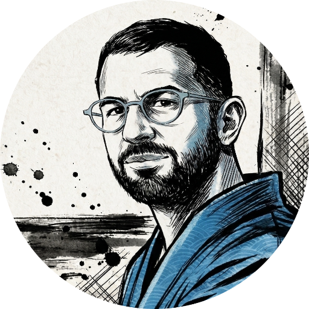

---
# the default layout is 'page'
icon: fa-solid fa-address-card
order: 2
---

<h2></h2>

  

    
Water engineer, master diver, and data enthusiast. I build data-driven solutions for hydrology challenges and explore the underwater world whenever I can.

  

  

    
  

<h2></h2>

  

    
  

  

    
I work as a hydrology consultant specializing in urban runoff management. On the side, I write Python, dive into data science, and share what I learn here.

  

<h2></h2>

  

    
Always exploring, always learning. Feel free to reach out if you want to collaborate or just talk water, code, or diving.

  

  

    
  

